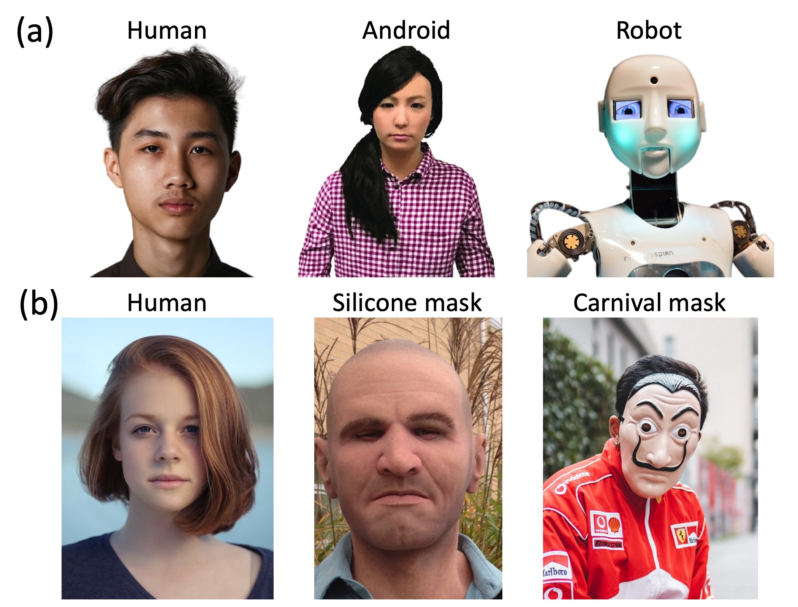

```{r setup, include=FALSE}

processdata <- 0  # this flag determines the amount of processing, with 4 levels:
# 0 - do no processing, generate the pdf using existing versions of all figures
# 1 - generate figures using the processed group data (requires 120MB of storage)
# 2 - do statistics and bootstrapping using processed data
# 3 - download all raw data and do preprocessing (requires ~60GB of storage)

nbootstraps <- 1000
targetelectrodes <- c(28,54,58,64)

# check which packages are installed, install the missing ones, and activate
packagelist <- c('knitr','e1071','signal','osfr','tictoc','BayesFactor','reshape2','powerplus','R.matlab') # list of CRAN packages
missingpackages <- packagelist[!packagelist %in% installed.packages()[,1]]
if (length(missingpackages)>0){install.packages(missingpackages)}
toinstall <- packagelist[which(!packagelist %in% (.packages()))]
invisible(lapply(toinstall,library,character.only=TRUE))

rawdir <- 'local/raw/'
rawdir <- '/Volumes/USB128/UncannyValley/'
processeddir <- 'local/output/'
# processeddir <- '/Volumes/USB128/UncannyValley/'

if (!dir.exists('local/')){dir.create('local/')}
# if (!dir.exists('local/robotsmvpa/')){dir.create('local/robotsmvpa/')}
# if (!dir.exists('local/masksmvpa/')){dir.create('local/masksmvpa/')}


collist <- c('lightsalmon','forestgreen','cornflowerblue')
bfcols <- c('gold','darkorange','firebrick')
colfunc <- colorRampPalette(c("darkgreen", "darkblue"))
colvect <- colfunc(29)
addalpha <- function(col, alpha=1){apply(sapply(col, col2rgb)/255, 2, function(x) rgb(x[1], x[2], x[3], alpha=alpha))}

getstartstop <- function(linestartstop){
  xpairs <- matrix(0, nrow = 1200, ncol = 2)
  paircounter <- 1
  startval <- linestartstop[1]
  lastval <- linestartstop[1]
  for (n in 2:length(linestartstop)){
    if ((linestartstop[n] - lastval) > 1){
      xpairs[paircounter, ] <- c(startval, lastval)
      startval <- linestartstop[n]
      paircounter <- paircounter + 1
    }
    lastval <- linestartstop[n]
  }
  xpairs[paircounter,] <- c(startval,lastval)
  xpairs <- xpairs[1:(paircounter+1),1:2]
  return(xpairs)}

# two functions used in prewhitening prior to MVPA
# data must be in the format sensor x time x trials
cov1para <- function(x){
  
  s <- dim(x)
  ti <- s[1]
  n <- s[2]
  meanx <- colMeans(x)
  x <- x - matrix(rep(meanx,ti),nrow=ti,ncol=n,byrow=TRUE)
  
  sample <- (1/ti)*(t(x)%*%x)
  
  meanvar <- sum(diag(sample))/n
  prior <- meanvar * diag(n)
  
  y <- x^2
  phiMat <- t(y) %*% y/ti - sample^2
  phi <- sum(phiMat)
  
  gamma <- sample - prior
  gamma <- sum(gamma^2)
  
  kappa <- phi/gamma
  shrinkage <- max(0,min(1,kappa/ti))
  
  sigma <- shrinkage * prior + (1-shrinkage) * sample
  
  return(sigma)}

whitenmatrix <- function(data,condid){
  
  # set up variables
  s <- dim(data)
  nvar <- s[1]
  ntimes <- s[2]
  ncond <- max(condid)
  Cov <- matrix(0,nrow=nvar,ncol=nvar)
  
  # compute whitening matrix
  for (cond in 1:ncond){
    dat <- data[,,which(condid==cond)]
    for (time in 1:ntimes){
      sigma <- cov1para(t(dat[,time,]))
      Cov <- Cov + sigma
    }
  }
  Cov <- Cov/(ncond*ntimes)
  W <- powerplus::Matpow(Cov,-0.5)
return(W)}


knitr::opts_chunk$set(echo = TRUE)

```

# Abstract

# Introduction

Many people report an aversion to entities that are superficially human-like, but on closer inspection are actually artificial. Examples include humanoid robots (androids), puppets, hyper-realistic masks, and computer-generated images or movies. The term 'uncanny valley' [@Mori1970; English translation in @Mori2012] describes the idea that entities that are clearly human or clearly artificial do not evoke unease, whereas artificial entities that are human-like are disconcerting. Understanding these experiences is increasingly important as artificial entities become more integrated into our everyday lives, however at present relatively little is known about the neural underpinnings of the uncanny valley effect.

Neural responses to faces and bodies in general are well-characterised, and there appear to be specialised brain regions devoted to both [reviewed in @Hu2020]. For example, areas of the occipital lobe [@Gauthier2000] and fusiform gyrus [@Kanwisher1997] respond more to faces than non-face stimuli, and sections of extrastriate cortex are responsive to bodies [@Downing2001]. There are also event-related potential (ERP) signals associated with face and body stimuli, though their precise purpose is still debated [@Thierry2007]. It seems highly likely that 'uncanny' images will activate these same processes, yet it is unclear whether the sense of unease they produce occurs at bottom-up sensory stages, or is modulated by more top-down cognitive factors.

One previous study has measured fMRI responses to moving stimuli designed to elicit an uncanny valley effect. @Saygin2012 found repetition suppression effects in action-specific brain regions responding to movies of androids that had a biological appearance, but mechanical motion. These effects were stronger than for movies of humans or mechanical robots performing the same actions. A more recent electroencephalography (EEG) study [@Urgen2018] identified a difference in the N400 component between dynamic and static conditions using the same stimuli. Although this difference was strongest over frontal electrodes, source reconstruction of the N400 itself suggested a left-lateralised source in temporo-parietal cortex, consistent with the fMRI results [@Saygin2012]. The authors interpret both of these findings as being due to the discrepancy between the human-like appearance and the clearly non-biological motion of the robot.

Our aim here was to further investigate neural correlates of the uncanny valley effect. We achieve this through two EEG experiments, in which we measure neural responses to static images. In the first experiment, the stimuli were humans, machine-like robots, and human-like robots (see Figure \ref{fig:stimexamples}a). In the second experiment we aimed to generalise the finding by using images of people wearing no masks, wearing obvious masks (e.g. carnival or Halloween masks), and wearing hyper-realistic silicone masks [@Sanders2017] (see Figure \ref{fig:stimexamples}b). Rather than focus on specific ERP components, we use a multivariate pattern classification approach to identify time windows in which information in the EEG signal can be used to distinguish between pairs of conditions. Our rationale is that timepoints where signals evoked by human faces can be distinguished from those evoked by human-like robots, or hyper-realistic masks, are candidates for a neural signature of the uncanny valley effect.

```{r stimexamples, fig.cap="Illustrative stimuli from the same categories as used in Experiments 1 and 2. Row (a) shows a human face, an android and a robot, all against white backgrounds. Row (b) shows a human face, a hyper-realistic silicone mask, and a carnival mask, all against natural backgrounds. Images were taken from a variety of sources that permit reuse in academic contexts and in most cases were not part of the stimulus set from the experiments. The silicone mask image was taken by the authors, and was used in Experiment 2.", fig.align="center", echo=FALSE, fig.width=8, fig.height=8}



```

# Materials & Methods

## Participants

A total of 29 participants completed Experiment 1 (12 male, 17 female), and 30 participants completed Experiment 2 (7 male, 23 female). None of the participants had previously taken part in a study using these stimuli, and all were naïve to the hypotheses and wore their normal optical correction if required. Written informed consent was collected before each experiment began, and all procedures were approved by the Ethics committee of the Department of Psychology at the University of York.

## Apparatus & stimuli

In Experiment 1, the stimulus set consisted of a total of 90 images, evenly split between three categories: real faces, human-like robots, and mechanical robots. Images all showed the head and shoulders of the subject, had white backgrounds, and were sourced from the internet. In Experiment 2, the stimulus set consisted of a total of 296 images, comprising real faces (148 images), people wearing silicone masks (74 images), and people wearing obvious masks of the sort typically worn for carnivals and Halloween celebrations (74 images). The backgrounds of these images were more heterogeneous, and showed the natural surroundings of the subject. In both experiments, images involved examples of both genders, and of varied ethnic backgrounds.

All stimuli were displayed on a ViewPixx display running at 120Hz, controlled by an Apple Macintosh computer. The display was gamma corrected using a photometer to ensure that the luminance output was linear. EEG data were collected using a 64-channel Waveguard cap and an ANT Neuroscan system, sampling at 1kHz. Low latency digital triggers were sent between the display and the EEG amplifier using an 8-bit parallel cable.

## Procedure

### Experiment 1: robots

Each participant completed three blocks of the first experiment. Within each block, all 90 stimulus images were presented twice in a random order. Stimuli subtended $11\times11$ degrees at the viewing distance of 57cm, and were shown against a mid-grey background, with a black central fixation cross displayed throughout. The presentation duration was 500ms, and participants were asked to press a mouse button to indicate if they believed each image was of a human or of a robot. After each response there was a random duration blank period with a mean duration of 1000ms and a standard deviation of 200ms. Each block lasted around 6 minutes.

### Experiment 2: hyper-realistic masks

Participants were shown all 296 images in a random order in each of three blocks. In the first block, stimuli subtended $5.5\times7.5$ degrees of visual angle when viewed at a distance of 57cm. In the second block, stimuli doubled in size (width and height), and subtended $11\times15$ degrees at the same viewing distance. In the third block, stimuli doubled in size again, and subtended $22\times30$ degrees. The rationale for the size manipulation was to investigate whether increasing levels of detail made the silicone masks more identifiable [@Sanders2017], however as that is not the main focus of the current paper we collapse results across size conditions. Stimuli were presented for 250ms, and participants indicated whether they thought each image contained a real face or a mask, using a two-button trackball. The button assignment (whether the left button indicated a face or a mask, and vice versa) was determined randomly for each participant, but remained constant throughout the whole experiment. Text reminding the participant of the button assignment was present continuously in the lower right corner of the screen, far from the area of the screen where the stimuli were presented. A central fixation cross was also present throughout. After each response there was a random duration blank period with a mean duration of 1000ms and a standard deviation of 200ms. Each block lasted around 8 minutes.

## Data analysis

We analysed response data by calculating d-prime scores for each condition, derived from the hit rate and false alarm rate [@Macmillan2005]. For the human conditions, the hit rate was the proportion of human images correctly identified as human, and the false alarm rate was the proportion of robot or mask images that were incorrectly judged as being human. For the robot and mask conditions, the hit rate was the proportion of robot/mask images correctly identified as not being human, and the false alarm rate was the proportion of human images that were incorrectly judged as being non-human (note that this means the false alarm rate was the same for the robot and android conditions, and for the silicone and Halloween mask conditions). We capped infinite d-prime values (which occur e.g. when the hit rate is 1) at an arbitrary ceiling of 5. We log transformed the reaction times (which typically have positive skew) and performed all averaging and statistical analysis on the logarithmic values.

EEG signals were recorded during each block, and saved to disc for subsequent offline analysis. We used components of the EEGlab toolbox [@Delorme2004] to import the data into Matlab and collate data across blocks. We then used Brainstorm [@Tadel2011] to filter the data using a bandpass filter (0.5 to 30Hz), epoch by condition, and subtract a pre-trial baseline (the mean voltage for the 200ms before stimulus onset). Five participants were excluded from the EEG analysis of each experiment due to excessive noise. Our attempts to clean up the data from these participants using independent components analysis was unsuccessful. Their behavioural data were still included in the analysis. In Experiment 2 we combined data across all three image sizes, as this was not the main focus of our analysis.

We performed univariate analyses by conducting Bayesian t-tests [@Rouder2009] between ERPs from pairs of conditions at each time point using a JZS prior. The resulting Bayes factor score is a summary of the evidence in favour of either the null hypothesis (that the waveforms are equal) or the alternative hypothesis (that they differ). We use the heuristics proposed by @Jeffreys1961 that Bayes factors >3 ($log_{10}BF_{10}$ > 0.5) constitute some evidence supporting the alternative hypothesis, factors >10 ($log_{10}BF_{10}$ > 1) constitute strong evidence, and factors >30 ($log_{10}BF_{10}$ > 1.5) constitute very strong evidence.

Multivariate pattern analysis was conducted by training a linear support vector machine algorithm (LibSVM; @Chang2011) to discriminate between patterns of activity across electrodes at a specific time point. The patterns came from the human face condition and one of the other conditions, for a single participant. Four examples of each pattern were calculated by averaging over random subsets of 20\% of the available trials from a given condition, and using these to train the classifier. The accuracy of the classifier was tested on the averaged remaining trials (that were not used in training) for each condition. This process was repeated 1000 times with different trial permutations to obtain an average accuracy, where chance performance is at 50\% correct. The analysis was carried out at all time points, and also for all participants. We then averaged classifier accuracy across participants, and calculated one sample Bayesian t-tests comparing to chance performance at each time point as described above.

## Data and code availability

Raw data, processed data, and analysis scripts are freely available through the project repository at: https://osf.io/5nz2h/

# Results

## Experiment 1

```{r include=FALSE, results='hide'}

# statistical analysis for experiment 1
processeddir <- 'local/robotsmvpa/'
excludelist <- c(2,4,5,9,13)

if (processdata > 1){
  
  comparisons <- matrix(c(1,2,1,3,2,3),nrow=3,ncol=2,byrow=TRUE)

datafiles <- dir(processeddir,pattern='*decoding.mat',full.names=TRUE)    
allmvpa <- array(0,dim=c(length(datafiles),3,1201))  
for (s in 1:length(datafiles)){
  data <- readMat(datafiles[s])
  allmvpa[s,,] <- data$Value/100
}    
times <- data$Time

datafiles1 <- dir(processeddir,pattern='*_101.mat',full.names=TRUE)    
datafiles2 <- dir(processeddir,pattern='*_102.mat',full.names=TRUE)    
datafiles3 <- dir(processeddir,pattern='*_103.mat',full.names=TRUE)    
allmeans <- array(0,dim=c(length(datafiles1),3,66,1201))
for (s in 1:length(datafiles1)){
  data <- readMat(datafiles1[s])
  allmeans[s,1,,] <- data$F*10^6
  data <- readMat(datafiles2[s])
  allmeans[s,2,,] <- data$F*10^6
  data <- readMat(datafiles3[s])
  allmeans[s,3,,] <- data$F*10^6
}     

allmvpa <- allmvpa[-excludelist,,]
allmeans <- allmeans[-excludelist,,,]

  allRobotRTs <- array(0,dim=c(29,3,180))
  allRobotaccuracy <- array(0,dim=c(29,3,180))
  allRobotdprime <- matrix(0,nrow=29,ncol=3)
  allRobottrialcounts <- matrix(0,nrow=29,ncol=3)

  for (s in 1:29){
    data <- readMat(paste0('local/RawData/Experiment 1/',s+300,'/',s+300,'trialorderRobots.mat'))
    
    trialorder <- data$R[5][[1]]
    responses <- data$R[7][[1]]
    RTs <- data$R[8][[1]]
    condlist <- data$R[4][[1]]
    condcounter <- c(0,0,0)
    sortedRT <- matrix(0,nrow=3,ncol=180)
    sortedresp <- matrix(0,nrow=3,ncol=180)
    
    for (block in 1:3){
      for (trial in 1:180){
        cond <- condlist[trialorder[block,trial]]
        condcounter[cond] <- condcounter[cond] + 1
        sortedRT[cond,condcounter[cond]] <- 20*log10(RTs[block,trial] * 1000)
        sortedresp[cond,condcounter[cond]] <- responses[block,trial] - 1
      }
    }
    
      hits <- NULL
  misses <- NULL
  for (cond in 1:3){
 
  if (cond<3){
  hits[cond] <- condcounter[cond]-sum(sortedresp[cond,1:condcounter[cond]])
  misses[cond] <- sum(sortedresp[cond,1:condcounter[cond]])
  }
  if (cond==3){
  hits[cond] <- sum(sortedresp[cond,1:condcounter[cond]])
  misses[cond] <- condcounter[cond]-sum(sortedresp[cond,1:condcounter[cond]])
  }
    
  }
    hitrate <- hits/(hits + misses)
  for (cond in 1:3){
    if (cond<3){falsealarms <- misses[3]/ (misses[3] + hits[3])}
    if (cond==3){falsealarms <- sum(misses[1:2]) / (sum(misses[1:2]) + sum(hits[1:2]))}
  allRobotdprime[s,cond] <- qnorm(hitrate[cond]) - qnorm(falsealarms)
  }
    
    allRobotRTs[s,,] <- sortedRT
    allRobotaccuracy[s,,] <- sortedresp
    allRobottrialcounts[s,] <- condcounter
  }
  
allRobotdprime[which(is.infinite(allRobotdprime))] <- 5
meanRobotRTs <- apply(allRobotRTs,1:2,mean)
  
dataforANOVA <- melt(allRobotdprime)
colnames(dataforANOVA) <- c('Participant','Condition','dprime')
dataforANOVA$Participant <- as.factor(dataforANOVA$Participant)
dataforANOVA$Condition <- as.factor(dataforANOVA$Condition)
bfdprime <- extractBF(anovaBF(dprime ~ Condition,dataforANOVA,whichRandom='Participant'))$bf

bfcontrasts <- NULL
for (comp in 1:3){
bfcontrasts[comp] <- extractBF(ttestBF(allRobotdprime[,comparisons[comp,1]],allRobotdprime[,comparisons[comp,2]],paired=TRUE))$bf}

dataforANOVA <- melt(meanRobotRTs)
colnames(dataforANOVA) <- c('Participant','Condition','RT')
dataforANOVA$Participant <- as.factor(dataforANOVA$Participant)
dataforANOVA$Condition <- as.factor(dataforANOVA$Condition)
bfRT <- extractBF(anovaBF(RT ~ Condition,dataforANOVA,whichRandom='Participant'))$bf

bfcontrastsRT <- NULL
for (comp in 1:3){
bfcontrastsRT[comp] <- extractBF(ttestBF(meanRobotRTs[,comparisons[comp,1]],meanRobotRTs[,comparisons[comp,2]],paired=TRUE))$bf}

subjmeanERP <- apply(allmeans,c(1,3,4),mean)
meanERP <- apply(allmeans,2:4,mean)
meanMVPA <- apply(allmvpa,2:3,mean)
grandmeanERP <- apply(subjmeanERP[,targetelectrodes,],3,mean)
subjERPs <- apply(subjmeanERP[,targetelectrodes,],c(1,3),mean)
condERPs <- apply(allmeans[,,targetelectrodes,],c(1,2,4),mean)

mlimits <- matrix(0,nrow=6,ncol=1201)
mBF <- matrix(0,nrow=3,ncol=1201)
bspop <- 1:nbootstraps
for (n in 1:1201){

  for (cond in 1:3){
  for (b in 1:nbootstraps){
    bspop[b] <- mean(sample(allmvpa[,cond,n],replace=TRUE))
  }
mlimits[(1:2)+((cond-1)*2),n] <- quantile(bspop,probs=c(0.025,0.975)) 
mBF[cond,n] <- extractBF(ttestBF(allmvpa[,cond,n],mu=0.5))$bf
  }
}

limits <- matrix(0,nrow=8,ncol=1201)
ERP_BF <- matrix(0,nrow=3,ncol=1201)
bspop <- 1:nbootstraps
for (n in 1:1201){

  for (b in 1:nbootstraps){
    bspop[b] <- mean(sample(subjERPs[,n],replace=TRUE))
  }
  limits[1:2,n] <- quantile(bspop,probs=c(0.025,0.975)) 
  
  for (cond in 1:3){
  for (b in 1:nbootstraps){
    bspop[b] <- mean(sample(condERPs[,cond,n],replace=TRUE))
  }
  limits[(1:2)+(cond*2),n] <- quantile(bspop,probs=c(0.025,0.975)) 
  ERP_BF[cond,n] <- extractBF(ttestBF(condERPs[,comparisons[cond,1],n],condERPs[,comparisons[cond,2],n],paired=TRUE))$bf
  }
}


chlist <- readMat('local/channel.mat')
chanlabels <- unlist(chlist$HeadPoints[[2]])
chanlocs <- read.csv('local/channeldata.csv')


save(file='local/GroupDataRobots.RData',list=c('allmeans','allmvpa','mlimits','subjmeanERP','limits','grandmeanERP','subjERPs','condERPs','meanMVPA','meanERP','mBF','ERP_BF','allRobotdprime','meanRobotRTs','bfdprime','bfRT','bfcontrasts','bfcontrastsRT','chanlocs','chanlabels'))

}

```

```{r include=FALSE, results='hide'}

# create figures for experiment 1

if (file.exists('local/GroupDataRobots.RData')){load('local/GroupDataRobots.RData')}  
if (processdata > 0){

pdf(paste0('Figures/RobotsData.pdf'), bg="transparent", height = 12, width = 12)

par(mfrow=c(2,2))

  plotlims <- c(0,5,0.5,3.5)  
  ticklocsy <- c(0.5,1,2,3,3.5)    
  ticklocsx <- 0:5    # locations of tick marks on y axis
  ticklabelsy <- c("","Robot","Android","Human","")       
  ticklabelsx <- ticklocsx    # set labels for y ticks
  
  plot(x=NULL,y=NULL,axes=FALSE, ann=FALSE, xlim=plotlims[1:2], ylim=plotlims[3:4])  
  axis(1, at=ticklocsx, tck=0.01, lab=F, lwd=2)     
  axis(2, at=ticklocsy, tck=0.01, lab=F, lwd=2)
  mtext(text = ticklabelsx, side = 1, at=ticklocsx,line=0.5,cex=1.5)     
  mtext(text = ticklabelsy, side = 2, at=ticklocsy, line=0.2, las=3,cex=1.5) 
  title(xlab="d prime", col.lab=rgb(0,0,0), line=1.8, cex.lab=1.8)

  text(0.15,3.3,'(a)',cex=3)
  
  a <- density(allRobotdprime[,1],cut=6)
  a$y <- 0.35*a$y/max(a$y)
  polygon(a$x,1.1+a$y,border=NA,col=addalpha(collist[1],0.5))

    a <- density(allRobotdprime[,2])
  a$y <- 0.35*a$y/max(a$y)
  polygon(a$x,2.1+a$y,border=NA,col=addalpha(collist[2],0.5))

    a <- density(allRobotdprime[,3])
  a$y <- 0.35*a$y/max(a$y)
  polygon(a$x,3.1+a$y,border=NA,col=addalpha(collist[3],0.5))

  xvals <- seq(-0.1,0.1,length=nrow(allRobotdprime))
  points(allRobotdprime[,1],1+xvals-0.2,pch=16,col=collist[1])
  points(allRobotdprime[,2],2+xvals-0.2,pch=15,col=collist[2])
  points(allRobotdprime[,3],3+xvals-0.2,pch=18,col=collist[3])

  for (cond in 1:3){
  bs <- NULL
  for (n in 1:nbootstraps){bs[n] <- mean(sample(allRobotdprime[,cond],replace=TRUE))}
  ci <- quantile(bs,c(0.025,0.975))
  arrows(mean(allRobotdprime[,cond]),cond,ci[1],cond,angle=90,length=0.1,lwd=3)
  arrows(mean(allRobotdprime[,cond]),cond,ci[2],cond,angle=90,length=0.1,lwd=3)
  }

  points(mean(allRobotdprime[,1]),1,pch=21,cex=2,lwd=2,bg=collist[1])
  points(mean(allRobotdprime[,2]),2,pch=22,cex=2,lwd=2,bg=collist[2])
  points(mean(allRobotdprime[,3]),3,pch=23,cex=2,lwd=2,bg=collist[3])


  
  plotlims <- c(52,64,0.5,3.5)  
  ticklocsy <- c(0.5,1,2,3,3.5)    
  ticklocsx <- c(52,58,64)    
  ticklabelsy <- c("","Robot","Android","Human","")       
  ticklabelsx <- c(400,800,1600)    # set labels for y ticks
  
  plot(x=NULL,y=NULL,axes=FALSE, ann=FALSE, xlim=plotlims[1:2], ylim=plotlims[3:4])  
  axis(1, at=ticklocsx, tck=0.01, lab=F, lwd=2)     
  axis(2, at=ticklocsy, tck=0.01, lab=F, lwd=2)
  mtext(text = ticklabelsx, side = 1, at=ticklocsx, line=0.5, cex=1.5)     
  mtext(text = ticklabelsy, side = 2, at=ticklocsy, line=0.2, las=3,cex=1.5) 
  title(xlab="Reaction time (ms)", col.lab=rgb(0,0,0), line=1.8, cex.lab=1.8)

    text(20*log10(420),3.3,'(b)',cex=3)

  a <- density(meanRobotRTs[,1],cut=6)
  a$y <- 0.35*a$y/max(a$y)
  polygon(a$x,1.1+a$y,border=NA,col=addalpha(collist[1],0.5))

    a <- density(meanRobotRTs[,2])
  a$y <- 0.35*a$y/max(a$y)
  polygon(a$x,2.1+a$y,border=NA,col=addalpha(collist[2],0.5))

    a <- density(meanRobotRTs[,3])
  a$y <- 0.35*a$y/max(a$y)
  polygon(a$x,3.1+a$y,border=NA,col=addalpha(collist[3],0.5))

  xvals <- seq(-0.1,0.1,length=nrow(meanRobotRTs))
  points(meanRobotRTs[,1],1+xvals-0.2,pch=16,col=collist[1])
  points(meanRobotRTs[,2],2+xvals-0.2,pch=15,col=collist[2])
  points(meanRobotRTs[,3],3+xvals-0.2,pch=18,col=collist[3])

  for (cond in 1:3){
  bs <- NULL
  for (n in 1:nbootstraps){bs[n] <- mean(sample(meanRobotRTs[,cond],replace=TRUE))}
  ci <- quantile(bs,c(0.025,0.975))
  arrows(mean(meanRobotRTs[,cond]),cond,ci[1],cond,angle=90,length=0.1,lwd=3)
  arrows(mean(meanRobotRTs[,cond]),cond,ci[2],cond,angle=90,length=0.1,lwd=3)
  }
  points(mean(meanRobotRTs[,1]),1,pch=21,cex=2,lwd=2,bg=collist[1])
  points(mean(meanRobotRTs[,2]),2,pch=22,cex=2,lwd=2,bg=collist[2])
  points(mean(meanRobotRTs[,3]),3,pch=23,cex=2,lwd=2,bg=collist[3])


par(mfrow=c(2,1),mfg=c(2,1))

plotlims <- c(-200,1000,-12,12)  
ticklocsx <- seq(-200,1000,200)    # locations of tick marks on x axis
ticklocsy <- seq(-12,12,4)    # locations of tick marks on y axis
ticklabelsx <- ticklocsx        # set labels for x ticks
ticklabelsy <- ticklocsy    # set labels for y ticks

plot(x=NULL,y=NULL,axes=FALSE, ann=FALSE, xlim=plotlims[1:2], ylim=plotlims[3:4])  
axis(1, at=ticklocsx, tck=0.01, lab=F, lwd=2)     # plot tick marks (no labels)
axis(2, at=ticklocsy, tck=0.01, lab=F, lwd=2)
mtext(text = ticklabelsx, side = 1, at=ticklocsx, line=0.5, cex=1.5)    
mtext(text = ticklabelsy, side = 2, at=ticklocsy, line=0.2, las=1, cex=1.5)  
title(xlab="Time (ms)", col.lab=rgb(0,0,0), line=1.5, cex.lab=1.8)   
title(ylab="Amplitude (µV)", col.lab=rgb(0,0,0), line=2.2, cex.lab=1.8)

  text(-200,10,'(c)',cex=3)

lines(c(-200,1000),c(0,0),lty=1)
lines(c(0,0),c(-20,20),lty=1)
polygon(c(0,500,500,0),c(-13,-13,-11,-11),col=rgb(0,0,0,0.3),border=NA)

polygon(c(-200:1000,1000:-200), c(limits[1,],limits[2,1201:1]), col=rgb(0,0,0,0.1),border=NA)

lines(-200:1000, grandmeanERP, lwd=3)     

  text(105,9.5,'P100',cex=2)
  text(155,-4,'N170',cex=2)
  text(250,4,'P200',cex=2)

  
chanindex <- match(toupper(chanlabels),toupper(chanlocs$Electrode))
chanxy <- chanlocs[chanindex,2:3]
lines(150*chanlocs$OutlineX-100,7.5*chanlocs$OutlineY + 6, lwd=2)
lines(150*chanlocs$NoseX-100,7.5*chanlocs$NoseY + 6, lwd=2)
lines(150*chanlocs$LearX-100,7.5*chanlocs$LearY + 6, lwd=2)
lines(150*chanlocs$RearX-100,7.5*chanlocs$RearY + 6, lwd=2)
points(150*chanlocs$X_position[1:64]-100,7.5*chanlocs$Y_position[1:64] + 6, pch=16,col='lightgrey')
points(150*chanlocs$X_position[chanindex[targetelectrodes]]-100,7.5*chanlocs$Y_position[chanindex[targetelectrodes]] + 6, pch=16,col='black')


dev.off()


pdf(paste0('Figures/RobotsMVPA.pdf'), bg="transparent", height = 12, width = 24)

par(mfrow=c(2,2))

times <- -199:1200

plotlims <- c(-200,1000,-12,12)  
ticklocsx <- seq(-200,1000,200)    # locations of tick marks on x axis
ticklocsy <- seq(-12,12,4)    # locations of tick marks on y axis
ticklabelsx <- ticklocsx        # set labels for x ticks
ticklabelsy <- ticklocsy    # set labels for y ticks

plot(x=NULL,y=NULL,axes=FALSE, ann=FALSE, xlim=plotlims[1:2], ylim=plotlims[3:4])  
axis(1, at=ticklocsx, tck=0.01, lab=F, lwd=2)    
axis(2, at=ticklocsy, tck=0.01, lab=F, lwd=2)
mtext(text = ticklabelsx, side = 1, at=ticklocsx, line=0.5, cex=1.5)    
mtext(text = ticklabelsy, side = 2, at=ticklocsy, line=0.2, las=1, cex=1.5)  
title(xlab="Time (ms)", col.lab=rgb(0,0,0), line=1.8, cex.lab=1.8)   
title(ylab="Amplitude (µV)", col.lab=rgb(0,0,0), line=2.2, cex.lab=1.8)

lines(c(-200,1000),c(0,0),lty=1)
lines(c(0,0),c(-20,20),lty=1)
polygon(c(0,500,500,0),c(-13,-13,-11,-11),col=rgb(0,0,0,0.3),border=NA)

polygon(c(-200:1000,1000:-200), c(limits[3,],limits[4,1201:1]), col=addalpha(collist[1],0.3),border=NA)
polygon(c(-200:1000,1000:-200), c(limits[7,],limits[8,1201:1]), col=addalpha(collist[3],0.3),border=NA)

lines(-200:1000, colMeans(meanERP[1,targetelectrodes,]), lwd=3, col=collist[1])     
lines(-200:1000, colMeans(meanERP[3,targetelectrodes,]), lwd=3, col=collist[3])     

chanindex <- match(toupper(chanlabels),toupper(chanlocs$Electrode))
chanxy <- chanlocs[chanindex,2:3]
lines(150*chanlocs$OutlineX-100,7.5*chanlocs$OutlineY + 6, lwd=2)
lines(150*chanlocs$NoseX-100,7.5*chanlocs$NoseY + 6, lwd=2)
lines(150*chanlocs$LearX-100,7.5*chanlocs$LearY + 6, lwd=2)
lines(150*chanlocs$RearX-100,7.5*chanlocs$RearY + 6, lwd=2)
points(150*chanlocs$X_position[1:64]-100,7.5*chanlocs$Y_position[1:64] + 6, pch=16,col='lightgrey')
points(150*chanlocs$X_position[chanindex[targetelectrodes]]-100,7.5*chanlocs$Y_position[chanindex[targetelectrodes]] + 6, pch=16,col='black')

allbfs <- ERP_BF[2,]

linestartstop <- times[allbfs>=3 & allbfs<10]
if (length(linestartstop)>1){xpairs <- getstartstop(linestartstop)
for (n in 1:((length(xpairs)/2)-1)){polygon(xpairs[n,c(1,2,2,1)], -c(8.5,8.5,7.5,7.5), col=bfcols[1],border=NA)}}

linestartstop <- times[allbfs>=10 & allbfs<30]
if (length(linestartstop)>1){xpairs <- getstartstop(linestartstop)
for (n in 1:((length(xpairs)/2)-1)){polygon(xpairs[n,c(1,2,2,1)], -c(8.5,8.5,7.5,7.5), col=bfcols[2],border=NA)}}

linestartstop <- times[allbfs>=30]
if (length(linestartstop)>1){xpairs <- getstartstop(linestartstop)
for (n in 1:((length(xpairs)/2)-1)){polygon(xpairs[n,c(1,2,2,1)], -c(8.5,8.5,7.5,7.5), col=bfcols[3],border=NA)}}

legend(700,12,c('Human','Robot'),lty=1,lwd=3,col=collist[c(3,1)],cex=1.8,box.lwd=2)
text(-190,11,'(a)',cex=3)

legend(-200,-6,c('BF>3','BF>10','BF>30'),lwd=5,col=bfcols, box.lwd=2, cex=1.5)


plotlims <- c(-200,1000,-12,12)  
ticklocsx <- seq(-200,1000,200)    # locations of tick marks on x axis
ticklocsy <- seq(-12,12,4)    # locations of tick marks on y axis
ticklabelsx <- ticklocsx        # set labels for x ticks
ticklabelsy <- ticklocsy    # set labels for y ticks

plot(x=NULL,y=NULL,axes=FALSE, ann=FALSE, xlim=plotlims[1:2], ylim=plotlims[3:4])  
axis(1, at=ticklocsx, tck=0.01, lab=F, lwd=2)     
axis(2, at=ticklocsy, tck=0.01, lab=F, lwd=2)
mtext(text = ticklabelsx, side = 1, at=ticklocsx, line=0.5, cex=1.5)    
mtext(text = ticklabelsy, side = 2, at=ticklocsy, line=0.2, las=1, cex=1.5)  
title(xlab="Time (ms)", col.lab=rgb(0,0,0), line=1.8, cex.lab=1.8)   
title(ylab="Amplitude (µV)", col.lab=rgb(0,0,0), line=2.2, cex.lab=1.8)

lines(c(-200,1000),c(0,0),lty=1)
lines(c(0,0),c(-20,20),lty=1)
polygon(c(0,500,500,0),c(-13,-13,-11,-11),col=rgb(0,0,0,0.3),border=NA)

polygon(c(-200:1000,1000:-200), c(limits[5,],limits[6,1201:1]), col=addalpha(collist[2],0.3),border=NA)
polygon(c(-200:1000,1000:-200), c(limits[7,],limits[8,1201:1]), col=addalpha(collist[3],0.3),border=NA)

lines(-200:1000, colMeans(meanERP[2,targetelectrodes,]), lwd=3, col=collist[2])     
lines(-200:1000, colMeans(meanERP[3,targetelectrodes,]), lwd=3, col=collist[3])     

chanindex <- match(toupper(chanlabels),toupper(chanlocs$Electrode))
chanxy <- chanlocs[chanindex,2:3]
lines(150*chanlocs$OutlineX-100,7.5*chanlocs$OutlineY + 6, lwd=2)
lines(150*chanlocs$NoseX-100,7.5*chanlocs$NoseY + 6, lwd=2)
lines(150*chanlocs$LearX-100,7.5*chanlocs$LearY + 6, lwd=2)
lines(150*chanlocs$RearX-100,7.5*chanlocs$RearY + 6, lwd=2)
points(150*chanlocs$X_position[1:64]-100,7.5*chanlocs$Y_position[1:64] + 6, pch=16,col='lightgrey')
points(150*chanlocs$X_position[chanindex[targetelectrodes]]-100,7.5*chanlocs$Y_position[chanindex[targetelectrodes]] + 6, pch=16,col='black')

allbfs <- ERP_BF[3,]

linestartstop <- times[allbfs>=3 & allbfs<10]
if (length(linestartstop)>1){xpairs <- getstartstop(linestartstop)
for (n in 1:((length(xpairs)/2)-1)){polygon(xpairs[n,c(1,2,2,1)], -c(8.5,8.5,7.5,7.5), col=bfcols[1],border=NA)}}

linestartstop <- times[allbfs>=10 & allbfs<30]
if (length(linestartstop)>1){xpairs <- getstartstop(linestartstop)
for (n in 1:((length(xpairs)/2)-1)){polygon(xpairs[n,c(1,2,2,1)], -c(8.5,8.5,7.5,7.5), col=bfcols[2],border=NA)}}

linestartstop <- times[allbfs>=30]
if (length(linestartstop)>1){xpairs <- getstartstop(linestartstop)
for (n in 1:((length(xpairs)/2)-1)){polygon(xpairs[n,c(1,2,2,1)], -c(8.5,8.5,7.5,7.5), col=bfcols[3],border=NA)}}

legend(700,12,c('Human','Android'),lty=1,lwd=3,col=collist[c(3,2)],cex=1.8,box.lwd=2)
text(-190,11,'(b)',cex=3)

legend(-200,-6,c('BF>3','BF>10','BF>30'),lwd=5,col=bfcols, box.lwd=2, cex=1.5)


plotlims <- c(-200,1000,0,1) 
ticklocsx <- seq(-200,1000,200)  
ticklocsy <- seq(0,1,0.25)    
ticklabelsx <- ticklocsx      
ticklabelsy <- ticklocsy*100   

plot(x=NULL,y=NULL,axes=FALSE, ann=FALSE, xlim=plotlims[1:2], ylim=plotlims[3:4])   
axis(1, at=ticklocsx, tck=0.01, lab=F, lwd=2)     
axis(2, at=ticklocsy, tck=0.01, lab=F, lwd=2)

mtext(text = ticklabelsx, side = 1, at=ticklocsx,line=0.5,cex=1.5)  
mtext(text = ticklabelsy, side = 2, at=ticklocsy, line=0.2, las=1,cex=1.5) 
title(xlab="Time (ms)", col.lab=rgb(0,0,0), line=1.8, cex.lab=1.8)  #}    
title(ylab="Classifier accuracy (%)", col.lab=rgb(0,0,0), line=2.2, cex.lab=1.8)
text(-190,0.95,'(c)',cex=3)

lines(c(-200, 1000),c(0.5, 0.5), col='black', lty=2)
lines(c(0,0),c(0,1), col='black')

polygon(c(-200:1000,1000:-200), c(mlimits[3,],mlimits[4,1201:1]), col=addalpha(collist[2],0.3),border=NA)


lines(-200:1000,meanMVPA[2,], col=collist[2], lwd=3, cex=0.5)     

allbfs <- mBF[2,]

linestartstop <- times[allbfs>=3 & allbfs<10]
if (length(linestartstop)>1){xpairs <- getstartstop(linestartstop)
for (n in 1:((length(xpairs)/2)-1)){polygon(xpairs[n,c(1,2,2,1)], c(0.24,0.24,0.26,0.26), col=bfcols[1],border=NA)}}

linestartstop <- times[allbfs>=10 & allbfs<30]
if (length(linestartstop)>1){xpairs <- getstartstop(linestartstop)
for (n in 1:((length(xpairs)/2)-1)){polygon(xpairs[n,c(1,2,2,1)], c(0.24,0.24,0.26,0.26), col=bfcols[2],border=NA)}}

linestartstop <- times[allbfs>=30]
if (length(linestartstop)>1){xpairs <- getstartstop(linestartstop)
for (n in 1:((length(xpairs)/2)-1)){polygon(xpairs[n,c(1,2,2,1)], c(0.24,0.24,0.26,0.26), col=bfcols[3],border=NA)}}

legend(-200,0.25,c('BF>3','BF>10','BF>30'),lwd=5,col=bfcols, box.lwd=2, cex=1.5)

plotlims <- c(-200,1000,0,1) 
ticklocsx <- seq(-200,1000,200)  
ticklocsy <- seq(0,1,0.25)    
ticklabelsx <- ticklocsx      
ticklabelsy <- ticklocsy*100   

plot(x=NULL,y=NULL,axes=FALSE, ann=FALSE, xlim=plotlims[1:2], ylim=plotlims[3:4])   
axis(1, at=ticklocsx, tck=0.01, lab=F, lwd=2)     
axis(2, at=ticklocsy, tck=0.01, lab=F, lwd=2)

mtext(text = ticklabelsx, side = 1, at=ticklocsx,line=0.5,cex=1.5)  
mtext(text = ticklabelsy, side = 2, at=ticklocsy, line=0.2, las=1,cex=1.5) 
title(xlab="Time (ms)", col.lab=rgb(0,0,0), line=1.8, cex.lab=1.8)  #}    
title(ylab="Classifier accuracy (%)", col.lab=rgb(0,0,0), line=2.2, cex.lab=1.8)
text(-190,0.95,'(d)',cex=3)

lines(c(-200, 1000),c(0.5, 0.5), col='black', lty=2)
lines(c(0,0),c(0,1), col='black')


polygon(c(-200:1000,1000:-200), c(mlimits[5,],mlimits[6,1201:1]), col=addalpha(collist[3],0.3),border=NA)


lines(-200:1000,meanMVPA[3,], col=collist[3], lwd=3, cex=0.5)    


allbfs <- mBF[3,]

linestartstop <- times[allbfs>=3 & allbfs<10]
if (length(linestartstop)>1){xpairs <- getstartstop(linestartstop)
for (n in 1:((length(xpairs)/2)-1)){polygon(xpairs[n,c(1,2,2,1)], c(0.24,0.24,0.26,0.26), col=bfcols[1],border=NA)}}

linestartstop <- times[allbfs>=10 & allbfs<30]
if (length(linestartstop)>1){xpairs <- getstartstop(linestartstop)
for (n in 1:((length(xpairs)/2)-1)){polygon(xpairs[n,c(1,2,2,1)], c(0.24,0.24,0.26,0.26), col=bfcols[2],border=NA)}}

linestartstop <- times[allbfs>=30]
if (length(linestartstop)>1){xpairs <- getstartstop(linestartstop)
for (n in 1:((length(xpairs)/2)-1)){polygon(xpairs[n,c(1,2,2,1)], c(0.24,0.24,0.26,0.26), col=bfcols[3],border=NA)}}

legend(-200,0.25,c('BF>3','BF>10','BF>30'),lwd=5,col=bfcols, box.lwd=2, cex=1.5)


dev.off()


}

conddprimes <- colMeans(allRobotdprime)
condRTs <- 10^(colMeans(meanRobotRTs)/20)

```

We first explored the behavioural results for identification of human versus non-human stimuli. We calculated d-prime scores to compare sensitivity across conditions. Sensitivity was highest for identifying robots (d' = `r round(conddprimes[1],digits=2)`), but still well above chance for both the human (d' = `r round(conddprimes[3],digits=2)`) and android (d' = `r round(conddprimes[2],digits=2)`) conditions. The Bayes factor score for a one-way ANOVA comparing these three conditions indicated very substantial evidence ($log_{10}BF_{10} =$ `r round(log10(bfdprime),digits=2)`) for a difference between conditions, as illustrated in Figure \ref{fig:RobotsData}a. Pairwise Bayesian t-tests between conditions indicate very convincing differences in sensitivity between robots and androids ($log_{10}BF_{10} =$ `r round(log10(bfcontrasts[1]),digits=2)`) and robots and humans ($log_{10}BF_{10} =$ `r round(log10(bfcontrasts[2]),digits=2)`). The difference between androids and humans ($log_{10}BF_{10} =$ `r round(log10(bfcontrasts[3]),digits=2)`) was also very substantial.

Reaction times also differed between conditions, though the effects were rather smaller. Reactions were fastest for identifying robots (RT = `r round(condRTs[1],digits=0)`ms), compared with humans (RT = `r round(condRTs[3],digits=0)`ms) and androids (RT = `r round(condRTs[2],digits=0)`ms). The Bayes factor score for a one-way ANOVA comparing these three conditions indicated strong evidence ($log_{10}BF_{10} =$ `r round(log10(bfRT),digits=2)`) for a difference between conditions, as illustrated in Figure \ref{fig:RobotsData}b. Pairwise Bayesian t-tests between conditions indicate very convincing differences in sensitivity between robots and androids ($log_{10}BF_{10} =$ `r round(log10(bfcontrastsRT[1]),digits=2)`) and robots and humans ($log_{10}BF_{10} =$ `r round(log10(bfcontrastsRT[2]),digits=2)`), whereas the reaction time was equivalent between androids and humans ($log_{10}BF_{10} =$ `r round(log10(bfcontrastsRT[3]),digits=2)`).

```{r RobotsData, fig.cap="Summary of response data and grand mean ERP for Experiment 1. Panel (a) shows d-prime scores for identifying images of human (blue), android (green) and robot (red) faces. Small points show individual participants, and the larger symbols with error bars indicate the group mean and bootstrapped 95 percent confidence intervals. Panel (b) plots reaction times in the same format (note the logarithmic x-axis). Panel (c) shows the grant mean ERP across all participants and conditions, pooled across electrodes P6, P8, PO6 and PO8 (see inset). The shaded region around the curve illustrates the 95 percent confidence interval, and the grey rectangle at the foot indicates the stimulus duration.", fig.align="center", echo=FALSE, fig.width=12, fig.height=12}

knitr::include_graphics('Figures/RobotsData.pdf')

```

EEG activity showed a clear visually evoked potential over posterior electrode sites (see Figure \ref{fig:RobotsData}c), with typical components found in response to visual stimuli (the P100, N170 and P200 are indicated in the figure). Pairwise comparisons of conditions are shown in Figure \ref{fig:RobotsMVPA}a,b. In general there is a tendency for the ERP response to human faces to diverge slightly from the other two conditions, however the evidence for a convincing difference was not compelling. Bayes factors exceeded 3 for only a small number of time points around 300-400ms in the comparison between human and robot images (see yellow bars at y = -8 in Figure \ref{fig:RobotsMVPA}a), but these differences were small considering the variance in the data.

```{r RobotsMVPA, fig.cap="Univariate and multivariate comparisons across image type. Panel (a) shows the ERPs comparing human (blue) and robot (red) face images, and panel (b) compares human (blue) and android (green) faces. Panels (c) and (d) show multivariate pattern classification accuracy for the same comparisons. Points at y = -8 and y = 25 indicate Bayes factor scores for comparisons between ERPs (a,b) and comparing classification accuracy to chance (50 percent correct; c,d).", fig.align="center", echo=FALSE, fig.width=12, fig.height=12}

knitr::include_graphics('Figures/RobotsMVPA.pdf')

```

We also conducted multivariate pattern analysis independently at each time-point for the same two comparisons. The evoked responses for human and robot images caused sufficiently distinct patterns of voltages across the scalp that the pattern classifier could distinguish them from around 100 ms following stimulus onset, with accuracy up to `r round(100*max(meanMVPA[2,]),digits=0)`\% correct (see Figure \ref{fig:RobotsMVPA}c). Bayes factors exceeded 30 for much of the time window between 100 and 800 ms, indicating that the decoding was meaningfully above chance performance (50\% correct). It was also possible to classify between human and android images (see Figure \ref{fig:RobotsMVPA}d), however performance was much poorer, with a maximum of `r round(100*max(meanMVPA[3,]),digits=0)`\% correct. Classification accuracy had an initial peak around 100ms that provided compelling evidence for above chance classification (BF>30), and a later region of above-chance classification between 500 and 700ms. In the Discussion we speculate that these two time periods might correspond to distinct types of signal associated with the uncanny valley. However we first sought to generalise our results to a different stimulus set, and next report the results of Experiment 2 which used hyper-realistic silicone masks.

## Experiment 2

```{r include=FALSE, results='hide'}

# statistical analysis for experiment 2
processeddir <- 'local/masksmvpa/'
excludelist <- c(3,16,24,26,29)

if (processdata > 1){
  
datafiles <- dir(processeddir,pattern='*decoding.mat',full.names=TRUE)    
allmvpa <- array(0,dim=c(length(datafiles),3,1201))  
for (s in 1:length(datafiles)){
  data <- readMat(datafiles[s])
  allmvpa[s,,] <- data$Value/100
}    
times <- data$Time

datafiles1 <- dir(processeddir,pattern='*_101.mat',full.names=TRUE)    
datafiles2 <- dir(processeddir,pattern='*_102.mat',full.names=TRUE)    
datafiles3 <- dir(processeddir,pattern='*_103.mat',full.names=TRUE)    
allmeans <- array(0,dim=c(length(datafiles1),3,66,1201))
for (s in 1:length(datafiles1)){
  data <- readMat(datafiles1[s])
  allmeans[s,1,,] <- data$F*10^6
  data <- readMat(datafiles2[s])
  allmeans[s,2,,] <- data$F*10^6
  data <- readMat(datafiles3[s])
  allmeans[s,3,,] <- data$F*10^6
}     

allmvpa <- allmvpa[-excludelist,,]
allmeans <- allmeans[-excludelist,,,]

  allMaskRTs <- array(0,dim=c(30,3,444))
  allMaskaccuracy <- array(0,dim=c(30,3,444))
  allMaskdprime <- matrix(0,nrow=30,ncol=3)
  allMasktrialcounts <- matrix(0,nrow=30,ncol=3)

  for (s in 1:30){
    data <- readMat(paste0('local/RawData/Experiment 2/',s+350,'/trialorderMasks.mat'))
    
    trialorder <- data$R[7][[1]]
    responses <- data$R[9][[1]]
    RTs <- data$R[10][[1]]
    condlist <- data$R[6][[1]]
    condcounter <- c(0,0,0)
    sortedRT <- matrix(0,nrow=3,ncol=444)
    sortedresp <- matrix(0,nrow=3,ncol=444)
    
    for (block in 1:3){
      for (trial in 1:296){
        cond <- condlist[trialorder[block,trial]]
        condcounter[cond] <- condcounter[cond] + 1
        sortedRT[cond,condcounter[cond]] <- 20*log10(RTs[block,trial] * 1000)
        sortedresp[cond,condcounter[cond]] <- responses[block,trial] - 1
      }
    }
    
      hits <- NULL
  misses <- NULL
  for (cond in 1:3){
 
  if (cond<3){
  hits[cond] <- condcounter[cond]-sum(sortedresp[cond,1:condcounter[cond]])
  misses[cond] <- sum(sortedresp[cond,1:condcounter[cond]])
  }
  if (cond==3){
  hits[cond] <- sum(sortedresp[cond,1:condcounter[cond]])
  misses[cond] <- condcounter[cond]-sum(sortedresp[cond,1:condcounter[cond]])
  }
    
  }
    hitrate <- hits/(hits + misses)
  for (cond in 1:3){
    if (cond<3){falsealarms <- misses[3]/ (misses[3] + hits[3])}
    if (cond==3){falsealarms <- sum(misses[1:2]) / (sum(misses[1:2]) + sum(hits[1:2]))}
  allMaskdprime[s,cond] <- qnorm(hitrate[cond]) - qnorm(falsealarms)
  }
    
    allMaskRTs[s,,] <- sortedRT
    allMaskaccuracy[s,,] <- sortedresp
    allMasktrialcounts[s,] <- condcounter
  }
  
allMaskdprime[which(is.infinite(allMaskdprime))] <- 5

meanMaskRTs <- matrix(0,nrow=30,ncol=3)
for (s in 1:30){
  for (cond in 1:3){
    meanMaskRTs[s,cond] <- mean(allMaskRTs[s,cond,1:allMasktrialcounts[s,cond]])
  }
}

dataforANOVA <- melt(allMaskdprime)
colnames(dataforANOVA) <- c('Participant','Condition','dprime')
dataforANOVA$Participant <- as.factor(dataforANOVA$Participant)
dataforANOVA$Condition <- as.factor(dataforANOVA$Condition)
bfdprime <- extractBF(anovaBF(dprime ~ Condition,dataforANOVA,whichRandom='Participant'))$bf

bfcontrasts <- NULL
for (comp in 1:3){
bfcontrasts[comp] <- extractBF(ttestBF(allMaskdprime[,comparisons[comp,1]],allMaskdprime[,comparisons[comp,2]],paired=TRUE))$bf}

dataforANOVA <- melt(meanMaskRTs)
colnames(dataforANOVA) <- c('Participant','Condition','RT')
dataforANOVA$Participant <- as.factor(dataforANOVA$Participant)
dataforANOVA$Condition <- as.factor(dataforANOVA$Condition)
bfRT <- extractBF(anovaBF(RT ~ Condition,dataforANOVA,whichRandom='Participant'))$bf

bfcontrastsRT <- NULL
for (comp in 1:3){
bfcontrastsRT[comp] <- extractBF(ttestBF(meanMaskRTs[,comparisons[comp,1]],meanMaskRTs[,comparisons[comp,2]],paired=TRUE))$bf}


subjmeanERP <- apply(allmeans,c(1,3,4),mean)
meanERP <- apply(allmeans,2:4,mean)
meanMVPA <- apply(allmvpa,2:3,mean)
grandmeanERP <- apply(subjmeanERP[,targetelectrodes,],3,mean)
subjERPs <- apply(subjmeanERP[,targetelectrodes,],c(1,3),mean)
condERPs <- apply(allmeans[,,targetelectrodes,],c(1,2,4),mean)

mlimits <- matrix(0,nrow=6,ncol=1201)
mBF <- matrix(0,nrow=3,ncol=1201)
bspop <- 1:nbootstraps
for (n in 1:1201){

  for (cond in 1:3){
  for (b in 1:nbootstraps){
    bspop[b] <- mean(sample(allmvpa[,cond,n],replace=TRUE))
  }
mlimits[(1:2)+((cond-1)*2),n] <- quantile(bspop,probs=c(0.025,0.975)) 
mBF[cond,n] <- extractBF(ttestBF(allmvpa[,cond,n],mu=0.5))$bf
  }
}

comparisons <- matrix(c(1,2,1,3,2,3),nrow=3,ncol=2,byrow=TRUE)
limits <- matrix(0,nrow=8,ncol=1201)
ERP_BF <- matrix(0,nrow=3,ncol=1201)
bspop <- 1:nbootstraps
for (n in 1:1201){

  for (b in 1:nbootstraps){
    bspop[b] <- mean(sample(subjERPs[,n],replace=TRUE))
  }
  limits[1:2,n] <- quantile(bspop,probs=c(0.025,0.975)) 
  
  for (cond in 1:3){
  for (b in 1:nbootstraps){
    bspop[b] <- mean(sample(condERPs[,cond,n],replace=TRUE))
  }
  limits[(1:2)+(cond*2),n] <- quantile(bspop,probs=c(0.025,0.975)) 
  ERP_BF[cond,n] <- extractBF(ttestBF(condERPs[,comparisons[cond,1],n],condERPs[,comparisons[cond,2],n],paired=TRUE))$bf
  }
}


chlist <- readMat('local/channel.mat')
chanlabels <- unlist(chlist$HeadPoints[[2]])
chanlocs <- read.csv('local/channeldata.csv')


save(file='local/GroupDataMasks.RData',list=c('allmeans','allmvpa','mlimits','subjmeanERP','limits','grandmeanERP','subjERPs','condERPs','meanMVPA','meanERP','mBF','ERP_BF','allMaskdprime','meanMaskRTs','bfdprime','bfRT','bfcontrasts','bfcontrastsRT','chanlocs','chanlabels'))
}


```

```{r include=FALSE, results='hide'}

# create figures for experiment 2

if (file.exists('local/GroupDataMasks.RData')){load('local/GroupDataMasks.RData')}  
if (processdata > 0){

pdf(paste0('Figures/MasksData.pdf'), bg="transparent", height = 12, width = 12)

par(mfrow=c(2,2))

  plotlims <- c(0,5,0.5,3.5)  
  ticklocsy <- c(0.5,1,2,3,3.5)    
  ticklocsx <- 0:5    # locations of tick marks on y axis
  ticklabelsy <- c("","Halloween","Silicone","Human","")       
  ticklabelsx <- ticklocsx    # set labels for y ticks
  
  plot(x=NULL,y=NULL,axes=FALSE, ann=FALSE, xlim=plotlims[1:2], ylim=plotlims[3:4])  
  axis(1, at=ticklocsx, tck=0.01, lab=F, lwd=2)     
  axis(2, at=ticklocsy, tck=0.01, lab=F, lwd=2)
  mtext(text = ticklabelsx, side = 1, at=ticklocsx,line=0.5,cex=1.5)     
  mtext(text = ticklabelsy, side = 2, at=ticklocsy, line=0.2, las=3,cex=1.5) 
  title(xlab="d prime", col.lab=rgb(0,0,0), line=1.8, cex.lab=1.8)

  text(0.15,3.3,'(a)',cex=3)
  
  a <- density(allMaskdprime[,1],cut=6)
  a$y <- 0.35*a$y/max(a$y)
  polygon(a$x,1.1+a$y,border=NA,col=addalpha(collist[1],0.5))

    a <- density(allMaskdprime[,2])
  a$y <- 0.35*a$y/max(a$y)
  polygon(a$x,2.1+a$y,border=NA,col=addalpha(collist[2],0.5))

    a <- density(allMaskdprime[,3])
  a$y <- 0.35*a$y/max(a$y)
  polygon(a$x,3.1+a$y,border=NA,col=addalpha(collist[3],0.5))

  xvals <- seq(-0.1,0.1,length=nrow(allMaskdprime))
  points(allMaskdprime[,1],1+xvals-0.2,pch=16,col=collist[1])
  points(allMaskdprime[,2],2+xvals-0.2,pch=15,col=collist[2])
  points(allMaskdprime[,3],3+xvals-0.2,pch=18,col=collist[3])

  for (cond in 1:3){
  bs <- NULL
  for (n in 1:nbootstraps){bs[n] <- mean(sample(allMaskdprime[,cond],replace=TRUE))}
  ci <- quantile(bs,c(0.025,0.975))
  arrows(mean(allMaskdprime[,cond]),cond,ci[1],cond,angle=90,length=0.1,lwd=3)
  arrows(mean(allMaskdprime[,cond]),cond,ci[2],cond,angle=90,length=0.1,lwd=3)
  }

  points(mean(allMaskdprime[,1]),1,pch=21,cex=2,lwd=2,bg=collist[1])
  points(mean(allMaskdprime[,2]),2,pch=22,cex=2,lwd=2,bg=collist[2])
  points(mean(allMaskdprime[,3]),3,pch=23,cex=2,lwd=2,bg=collist[3])


  
  plotlims <- c(49,61,0.5,3.5)  
  ticklocsy <- c(0.5,1,2,3,3.5)    
  ticklocsx <- seq(49,61,3)
  ticklabelsy <- c("","Halloween","Silicone","Human","")       
  ticklabelsx <- c('','400','','800','')    # set labels for y ticks
  
  plot(x=NULL,y=NULL,axes=FALSE, ann=FALSE, xlim=plotlims[1:2], ylim=plotlims[3:4])  
  axis(1, at=ticklocsx, tck=0.01, lab=F, lwd=2)     
  axis(2, at=ticklocsy, tck=0.01, lab=F, lwd=2)
  mtext(text = ticklabelsx, side = 1, at=ticklocsx, line=0.5, cex=1.5)     
  mtext(text = ticklabelsy, side = 2, at=ticklocsy, line=0.2, las=3,cex=1.5) 
  title(xlab="Reaction time (ms)", col.lab=rgb(0,0,0), line=1.8, cex.lab=1.8)

    text(20*log10(300),3.3,'(b)',cex=3)

  a <- density(meanMaskRTs[,1],cut=6)
  a$y <- 0.35*a$y/max(a$y)
  polygon(a$x,1.1+a$y,border=NA,col=addalpha(collist[1],0.5))

    a <- density(meanMaskRTs[,2])
  a$y <- 0.35*a$y/max(a$y)
  polygon(a$x,2.1+a$y,border=NA,col=addalpha(collist[2],0.5))

    a <- density(meanMaskRTs[,3])
  a$y <- 0.35*a$y/max(a$y)
  polygon(a$x,3.1+a$y,border=NA,col=addalpha(collist[3],0.5))

  xvals <- seq(-0.1,0.1,length=nrow(meanMaskRTs))
  points(meanMaskRTs[,1],1+xvals-0.2,pch=16,col=collist[1])
  points(meanMaskRTs[,2],2+xvals-0.2,pch=15,col=collist[2])
  points(meanMaskRTs[,3],3+xvals-0.2,pch=18,col=collist[3])

  for (cond in 1:3){
  bs <- NULL
  for (n in 1:nbootstraps){bs[n] <- mean(sample(meanMaskRTs[,cond],replace=TRUE))}
  ci <- quantile(bs,c(0.025,0.975))
  arrows(mean(meanMaskRTs[,cond]),cond,ci[1],cond,angle=90,length=0.1,lwd=3)
  arrows(mean(meanMaskRTs[,cond]),cond,ci[2],cond,angle=90,length=0.1,lwd=3)
  }
  points(mean(meanMaskRTs[,1]),1,pch=21,cex=2,lwd=2,bg=collist[1])
  points(mean(meanMaskRTs[,2]),2,pch=22,cex=2,lwd=2,bg=collist[2])
  points(mean(meanMaskRTs[,3]),3,pch=23,cex=2,lwd=2,bg=collist[3])


par(mfrow=c(2,1),mfg=c(2,1))

plotlims <- c(-200,1000,-12,12)  
ticklocsx <- seq(-200,1000,200)    # locations of tick marks on x axis
ticklocsy <- seq(-12,12,4)    # locations of tick marks on y axis
ticklabelsx <- ticklocsx        # set labels for x ticks
ticklabelsy <- ticklocsy    # set labels for y ticks

plot(x=NULL,y=NULL,axes=FALSE, ann=FALSE, xlim=plotlims[1:2], ylim=plotlims[3:4])  
axis(1, at=ticklocsx, tck=0.01, lab=F, lwd=2)     # plot tick marks (no labels)
axis(2, at=ticklocsy, tck=0.01, lab=F, lwd=2)
mtext(text = ticklabelsx, side = 1, at=ticklocsx, line=0.5, cex=1.5)    
mtext(text = ticklabelsy, side = 2, at=ticklocsy, line=0.2, las=1, cex=1.5)  
title(xlab="Time (ms)", col.lab=rgb(0,0,0), line=1.5, cex.lab=1.8)   
title(ylab="Amplitude (µV)", col.lab=rgb(0,0,0), line=2.2, cex.lab=1.8)

  text(-200,10,'(c)',cex=3)

lines(c(-200,1000),c(0,0),lty=1)
lines(c(0,0),c(-20,20),lty=1)
polygon(c(0,250,250,0),c(-13,-13,-11,-11),col=rgb(0,0,0,0.3),border=NA)

polygon(c(-200:1000,1000:-200), c(limits[1,],limits[2,1201:1]), col=rgb(0,0,0,0.1),border=NA)

lines(-200:1000, grandmeanERP, lwd=3)     

  text(105,10,'P100',cex=2)
  text(155,-4,'N170',cex=2)
  text(250,4.5,'P200',cex=2)

  
chanindex <- match(toupper(chanlabels),toupper(chanlocs$Electrode))
chanxy <- chanlocs[chanindex,2:3]
lines(150*chanlocs$OutlineX-100,7.5*chanlocs$OutlineY + 6, lwd=2)
lines(150*chanlocs$NoseX-100,7.5*chanlocs$NoseY + 6, lwd=2)
lines(150*chanlocs$LearX-100,7.5*chanlocs$LearY + 6, lwd=2)
lines(150*chanlocs$RearX-100,7.5*chanlocs$RearY + 6, lwd=2)
points(150*chanlocs$X_position[1:64]-100,7.5*chanlocs$Y_position[1:64] + 6, pch=16,col='lightgrey')
points(150*chanlocs$X_position[chanindex[targetelectrodes]]-100,7.5*chanlocs$Y_position[chanindex[targetelectrodes]] + 6, pch=16,col='black')


dev.off()


pdf(paste0('Figures/MasksMVPA.pdf'), bg="transparent", height = 12, width = 24)

par(mfrow=c(2,2))

times <- -199:1200

plotlims <- c(-200,1000,-12,12)  
ticklocsx <- seq(-200,1000,200)    # locations of tick marks on x axis
ticklocsy <- seq(-12,12,4)    # locations of tick marks on y axis
ticklabelsx <- ticklocsx        # set labels for x ticks
ticklabelsy <- ticklocsy    # set labels for y ticks

plot(x=NULL,y=NULL,axes=FALSE, ann=FALSE, xlim=plotlims[1:2], ylim=plotlims[3:4])  
axis(1, at=ticklocsx, tck=0.01, lab=F, lwd=2)    
axis(2, at=ticklocsy, tck=0.01, lab=F, lwd=2)
mtext(text = ticklabelsx, side = 1, at=ticklocsx, line=0.5, cex=1.5)    
mtext(text = ticklabelsy, side = 2, at=ticklocsy, line=0.2, las=1, cex=1.5)  
title(xlab="Time (ms)", col.lab=rgb(0,0,0), line=1.8, cex.lab=1.8)   
title(ylab="Amplitude (µV)", col.lab=rgb(0,0,0), line=2.2, cex.lab=1.8)

lines(c(-200,1000),c(0,0),lty=1)
lines(c(0,0),c(-20,20),lty=1)
polygon(c(0,250,250,0),c(-13,-13,-11,-11),col=rgb(0,0,0,0.3),border=NA)

polygon(c(-200:1000,1000:-200), c(limits[3,],limits[4,1201:1]), col=addalpha(collist[1],0.3),border=NA)
polygon(c(-200:1000,1000:-200), c(limits[7,],limits[8,1201:1]), col=addalpha(collist[3],0.3),border=NA)

lines(-200:1000, colMeans(meanERP[1,targetelectrodes,]), lwd=3, col=collist[1])     
lines(-200:1000, colMeans(meanERP[3,targetelectrodes,]), lwd=3, col=collist[3])     

chanindex <- match(toupper(chanlabels),toupper(chanlocs$Electrode))
chanxy <- chanlocs[chanindex,2:3]
lines(150*chanlocs$OutlineX-100,7.5*chanlocs$OutlineY + 6, lwd=2)
lines(150*chanlocs$NoseX-100,7.5*chanlocs$NoseY + 6, lwd=2)
lines(150*chanlocs$LearX-100,7.5*chanlocs$LearY + 6, lwd=2)
lines(150*chanlocs$RearX-100,7.5*chanlocs$RearY + 6, lwd=2)
points(150*chanlocs$X_position[1:64]-100,7.5*chanlocs$Y_position[1:64] + 6, pch=16,col='lightgrey')
points(150*chanlocs$X_position[chanindex[targetelectrodes]]-100,7.5*chanlocs$Y_position[chanindex[targetelectrodes]] + 6, pch=16,col='black')


allbfs <- ERP_BF[2,]

linestartstop <- times[allbfs>=3 & allbfs<10]
if (length(linestartstop)>1){xpairs <- getstartstop(linestartstop)
for (n in 1:((length(xpairs)/2)-1)){polygon(xpairs[n,c(1,2,2,1)], -c(8.5,8.5,7.5,7.5), col=bfcols[1],border=NA)}}

linestartstop <- times[allbfs>=10 & allbfs<30]
if (length(linestartstop)>1){xpairs <- getstartstop(linestartstop)
for (n in 1:((length(xpairs)/2)-1)){polygon(xpairs[n,c(1,2,2,1)], -c(8.5,8.5,7.5,7.5), col=bfcols[2],border=NA)}}

linestartstop <- times[allbfs>=30]
if (length(linestartstop)>1){xpairs <- getstartstop(linestartstop)
for (n in 1:((length(xpairs)/2)-1)){polygon(xpairs[n,c(1,2,2,1)], -c(8.5,8.5,7.5,7.5), col=bfcols[3],border=NA)}}


legend(700,12,c('Human','Halloween'),lty=1,lwd=3,col=collist[c(3,1)],cex=1.8,box.lwd=2)
text(-190,11,'(a)',cex=3)

legend(-200,-6,c('BF>3','BF>10','BF>30'),lwd=5,col=bfcols, box.lwd=2, cex=1.5)


plotlims <- c(-200,1000,-12,12)  
ticklocsx <- seq(-200,1000,200)    # locations of tick marks on x axis
ticklocsy <- seq(-12,12,4)    # locations of tick marks on y axis
ticklabelsx <- ticklocsx        # set labels for x ticks
ticklabelsy <- ticklocsy    # set labels for y ticks

plot(x=NULL,y=NULL,axes=FALSE, ann=FALSE, xlim=plotlims[1:2], ylim=plotlims[3:4])  
axis(1, at=ticklocsx, tck=0.01, lab=F, lwd=2)     
axis(2, at=ticklocsy, tck=0.01, lab=F, lwd=2)
mtext(text = ticklabelsx, side = 1, at=ticklocsx, line=0.5, cex=1.5)    
mtext(text = ticklabelsy, side = 2, at=ticklocsy, line=0.2, las=1, cex=1.5)  
title(xlab="Time (ms)", col.lab=rgb(0,0,0), line=1.8, cex.lab=1.8)   
title(ylab="Amplitude (µV)", col.lab=rgb(0,0,0), line=2.2, cex.lab=1.8)

lines(c(-200,1000),c(0,0),lty=1)
lines(c(0,0),c(-20,20),lty=1)
polygon(c(0,250,250,0),c(-13,-13,-11,-11),col=rgb(0,0,0,0.3),border=NA)

polygon(c(-200:1000,1000:-200), c(limits[5,],limits[6,1201:1]), col=addalpha(collist[2],0.3),border=NA)
polygon(c(-200:1000,1000:-200), c(limits[7,],limits[8,1201:1]), col=addalpha(collist[3],0.3),border=NA)

lines(-200:1000, colMeans(meanERP[2,targetelectrodes,]), lwd=3, col=collist[2])     
lines(-200:1000, colMeans(meanERP[3,targetelectrodes,]), lwd=3, col=collist[3])     

chanindex <- match(toupper(chanlabels),toupper(chanlocs$Electrode))
chanxy <- chanlocs[chanindex,2:3]
lines(150*chanlocs$OutlineX-100,7.5*chanlocs$OutlineY + 6, lwd=2)
lines(150*chanlocs$NoseX-100,7.5*chanlocs$NoseY + 6, lwd=2)
lines(150*chanlocs$LearX-100,7.5*chanlocs$LearY + 6, lwd=2)
lines(150*chanlocs$RearX-100,7.5*chanlocs$RearY + 6, lwd=2)
points(150*chanlocs$X_position[1:64]-100,7.5*chanlocs$Y_position[1:64] + 6, pch=16,col='lightgrey')
points(150*chanlocs$X_position[chanindex[targetelectrodes]]-100,7.5*chanlocs$Y_position[chanindex[targetelectrodes]] + 6, pch=16,col='black')


allbfs <- ERP_BF[3,]

linestartstop <- times[allbfs>=3 & allbfs<10]
if (length(linestartstop)>1){xpairs <- getstartstop(linestartstop)
for (n in 1:((length(xpairs)/2)-1)){polygon(xpairs[n,c(1,2,2,1)], -c(8.5,8.5,7.5,7.5), col=bfcols[1],border=NA)}}

linestartstop <- times[allbfs>=10 & allbfs<30]
if (length(linestartstop)>1){xpairs <- getstartstop(linestartstop)
for (n in 1:((length(xpairs)/2)-1)){polygon(xpairs[n,c(1,2,2,1)], -c(8.5,8.5,7.5,7.5), col=bfcols[2],border=NA)}}

linestartstop <- times[allbfs>=30]
if (length(linestartstop)>1){xpairs <- getstartstop(linestartstop)
for (n in 1:((length(xpairs)/2)-1)){polygon(xpairs[n,c(1,2,2,1)], -c(8.5,8.5,7.5,7.5), col=bfcols[3],border=NA)}}


legend(700,12,c('Human','Silicone'),lty=1,lwd=3,col=collist[c(3,2)],cex=1.8,box.lwd=2)
text(-190,11,'(b)',cex=3)

legend(-200,-6,c('BF>3','BF>10','BF>30'),lwd=5,col=bfcols, box.lwd=2, cex=1.5)

plotlims <- c(-200,1000,0,1) 
ticklocsx <- seq(-200,1000,200)  
ticklocsy <- seq(0,1,0.25)    
ticklabelsx <- ticklocsx      
ticklabelsy <- ticklocsy*100   

plot(x=NULL,y=NULL,axes=FALSE, ann=FALSE, xlim=plotlims[1:2], ylim=plotlims[3:4])   
axis(1, at=ticklocsx, tck=0.01, lab=F, lwd=2)     
axis(2, at=ticklocsy, tck=0.01, lab=F, lwd=2)

mtext(text = ticklabelsx, side = 1, at=ticklocsx,line=0.5,cex=1.5)  
mtext(text = ticklabelsy, side = 2, at=ticklocsy, line=0.2, las=1,cex=1.5) 
title(xlab="Time (ms)", col.lab=rgb(0,0,0), line=1.8, cex.lab=1.8)  #}    
title(ylab="Classifier accuracy (%)", col.lab=rgb(0,0,0), line=2.2, cex.lab=1.8)
text(-190,0.95,'(c)',cex=3)

lines(c(-200, 1000),c(0.5, 0.5), col='black', lty=2)
lines(c(0,0),c(0,1), col='black')

polygon(c(-200:1000,1000:-200), c(mlimits[3,],mlimits[4,1201:1]), col=addalpha(collist[2],0.3),border=NA)


lines(-200:1000,meanMVPA[2,], col=collist[2], lwd=3, cex=0.5)     

allbfs <- mBF[2,]

linestartstop <- times[allbfs>=3 & allbfs<10]
if (length(linestartstop)>1){xpairs <- getstartstop(linestartstop)
for (n in 1:((length(xpairs)/2)-1)){polygon(xpairs[n,c(1,2,2,1)], c(0.24,0.24,0.26,0.26), col=bfcols[1],border=NA)}}

linestartstop <- times[allbfs>=10 & allbfs<30]
if (length(linestartstop)>1){xpairs <- getstartstop(linestartstop)
for (n in 1:((length(xpairs)/2)-1)){polygon(xpairs[n,c(1,2,2,1)], c(0.24,0.24,0.26,0.26), col=bfcols[2],border=NA)}}

linestartstop <- times[allbfs>=30]
if (length(linestartstop)>1){xpairs <- getstartstop(linestartstop)
for (n in 1:((length(xpairs)/2)-1)){polygon(xpairs[n,c(1,2,2,1)], c(0.24,0.24,0.26,0.26), col=bfcols[3],border=NA)}}

legend(-200,0.25,c('BF>3','BF>10','BF>30'),lwd=5,col=bfcols, box.lwd=2, cex=1.5)

plotlims <- c(-200,1000,0,1) 
ticklocsx <- seq(-200,1000,200)  
ticklocsy <- seq(0,1,0.25)    
ticklabelsx <- ticklocsx      
ticklabelsy <- ticklocsy*100   

plot(x=NULL,y=NULL,axes=FALSE, ann=FALSE, xlim=plotlims[1:2], ylim=plotlims[3:4])   
axis(1, at=ticklocsx, tck=0.01, lab=F, lwd=2)     
axis(2, at=ticklocsy, tck=0.01, lab=F, lwd=2)

mtext(text = ticklabelsx, side = 1, at=ticklocsx,line=0.5,cex=1.5)  
mtext(text = ticklabelsy, side = 2, at=ticklocsy, line=0.2, las=1,cex=1.5) 
title(xlab="Time (ms)", col.lab=rgb(0,0,0), line=1.8, cex.lab=1.8)  #}    
title(ylab="Classifier accuracy (%)", col.lab=rgb(0,0,0), line=2.2, cex.lab=1.8)
text(-190,0.95,'(d)',cex=3)

lines(c(-200, 1000),c(0.5, 0.5), col='black', lty=2)
lines(c(0,0),c(0,1), col='black')


polygon(c(-200:1000,1000:-200), c(mlimits[5,],mlimits[6,1201:1]), col=addalpha(collist[3],0.3),border=NA)


lines(-200:1000,meanMVPA[3,], col=collist[3], lwd=3, cex=0.5)    


allbfs <- mBF[3,]

linestartstop <- times[allbfs>=3 & allbfs<10]
if (length(linestartstop)>1){xpairs <- getstartstop(linestartstop)
for (n in 1:((length(xpairs)/2)-1)){polygon(xpairs[n,c(1,2,2,1)], c(0.24,0.24,0.26,0.26), col=bfcols[1],border=NA)}}

linestartstop <- times[allbfs>=10 & allbfs<30]
if (length(linestartstop)>1){xpairs <- getstartstop(linestartstop)
for (n in 1:((length(xpairs)/2)-1)){polygon(xpairs[n,c(1,2,2,1)], c(0.24,0.24,0.26,0.26), col=bfcols[2],border=NA)}}

linestartstop <- times[allbfs>=30]
if (length(linestartstop)>1){xpairs <- getstartstop(linestartstop)
for (n in 1:((length(xpairs)/2)-1)){polygon(xpairs[n,c(1,2,2,1)], c(0.24,0.24,0.26,0.26), col=bfcols[3],border=NA)}}

legend(-200,0.25,c('BF>3','BF>10','BF>30'),lwd=5,col=bfcols, box.lwd=2, cex=1.5)

dev.off()


}

conddprimes <- colMeans(allMaskdprime)
condRTs <- 10^(colMeans(meanMaskRTs)/20)

```

The results of Experiment 2 were similar to those of Experiment 1, despite using a quite different stimulus set involving images of humans wearing masks, rather than robots. Sensitivity was highest for identifying Halloween masks (d' = `r round(conddprimes[1],digits=2)`), but still well above chance for both the human (d' = `r round(conddprimes[3],digits=2)`) and silicone mask (d' = `r round(conddprimes[2],digits=2)`) conditions. The Bayes factor score for a one-way ANOVA comparing these three conditions indicated very substantial evidence ($log_{10}BF_{10} =$ `r round(log10(bfdprime),digits=2)`) for a difference between conditions, as illustrated in Figure \ref{fig:MasksData}a. Pairwise Bayesian t-tests between conditions indicate very convincing differences in sensitivity between Halloween and silicone masks ($log_{10}BF_{10} =$ `r round(log10(bfcontrasts[1]),digits=2)`) between Halloween masks and humans ($log_{10}BF_{10} =$ `r round(log10(bfcontrasts[2]),digits=2)`), and between silicone masks and humans ($log_{10}BF_{10} =$ `r round(log10(bfcontrasts[3]),digits=2)`). Unlike in Experiment 1, there were no convincing reaction time differences between conditions ($log_{10}BF_{10} =$ `r round(log10(bfRT),digits=2)`), as illustrated in Figure \ref{fig:MasksData}b.

```{r MasksData, fig.cap="Summary of response data and grand mean ERP for Experiment 2. Panel (a) shows d-prime scores for identifying images of human faces (blue), silicone masks (green) and Halloween masks (red). Small points show individual participants, and the larger symbols with error bars indicate the group mean and bootstrapped 95 percent confidence intervals. Panel (b) plots reaction times in the same format (note the logarithmic x-axis). Panel (c) shows the grant mean ERP across all participants and conditions, pooled across electrodes P6, P8, PO6 and PO8 (see inset). The shaded region around the curve illustrates the 95 percent confidence interval, and the grey rectangle at the foot indicates the stimulus duration.", fig.align="center", echo=FALSE, fig.width=12, fig.height=12}

knitr::include_graphics('Figures/MaskSData.pdf')

```

The grand average ERP waveform for Experiment 2 (see Figure \ref{fig:MasksData}c) had similar initial components as for Experiment 1. The latter portion of the waveforms differed somewhat, most likely owing to the difference in presentation duration across experiments (250ms versus 500ms). There was a substantial univariate difference in ERP response between human and Halloween mask conditions extending from around 170 to 230ms following stimulus onset (see Figure \ref{fig:MasksMVPA}a), with Bayes factors exceeding 30. Univariate differences between the human and silicone mask conditions were not compelling (see Figure \ref{fig:MasksMVPA}b).

```{r MasksMVPA, fig.cap="Univariate and multivariate comparisons across image type for Experiment 2. Panel (a) shows the ERPs comparing human faces (blue) and Halloween masks (red), and panel (b) compares human faces (blue) and silicone masks (green). Panels (c) and (d) show multivariate pattern classification accuracy for the same comparisons. Points at y = -8 and y = 25 indicate Bayes factor scores for comparisons between ERPs (a,b) and comparing classification accuracy to chance (50 percent correct; c,d).", fig.align="center", echo=FALSE, fig.width=12, fig.height=12}

knitr::include_graphics('Figures/MaskSMVPA.pdf')

```

Multivariate pattern analysis revealed extremely high classification accuracy (up to `r round(100*max(meanMVPA[2,]),digits=0)`\% correct) comparing human faces with Halloween masks. This was convincingly above chance, with a Bayes factor score exceeding 30 from around 100ms following stimulus onset, and extending across the full time window (see Figure \ref{fig:MasksMVPA}c). Classification was also convincingly above chance when comparing human faces with silicone masks (Figure \ref{fig:MasksMVPA}d). This timecourse had an initial peak of high accuracy (up to `r round(100*max(meanMVPA[3,]),digits=0)`\% correct) between 100 and 200ms after stimulus onset, followed by a second peak around 600ms. This replicates the finding from Experiment 1 that uncanny valley responses might involve two distinct components at different moments in time.

# Discussion


# Conclusions

# Acknowledgements

SF was funded by a YorRobots Venables internship. Also supported by BBSRC grant BB/V007580/1 awarded to DHB. ANY OTHER GRANTS TO ACKNOWLEDGE HERE?

# References


